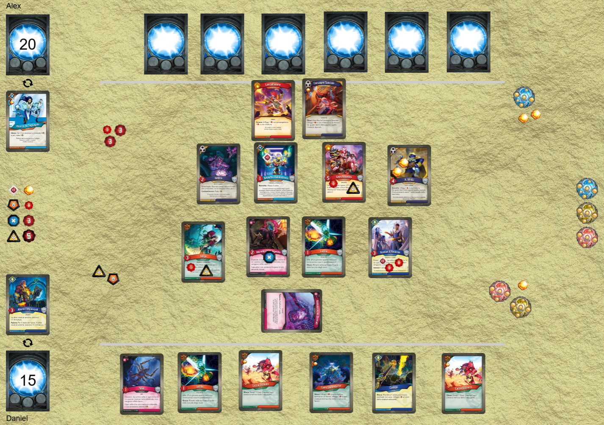
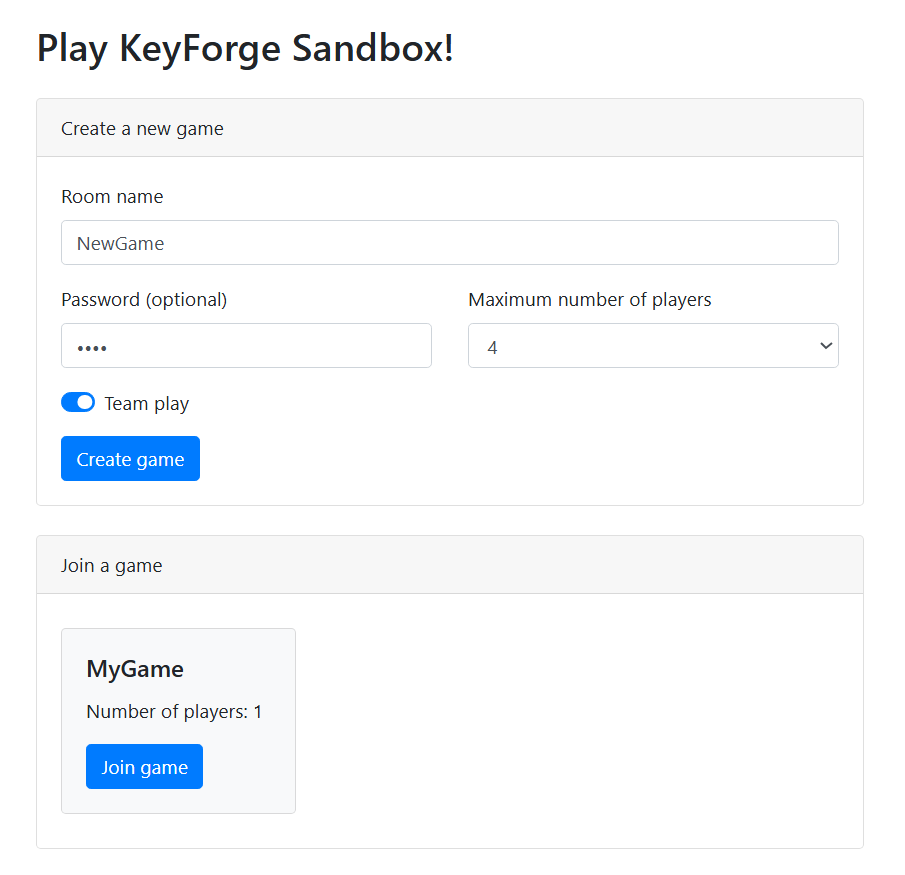
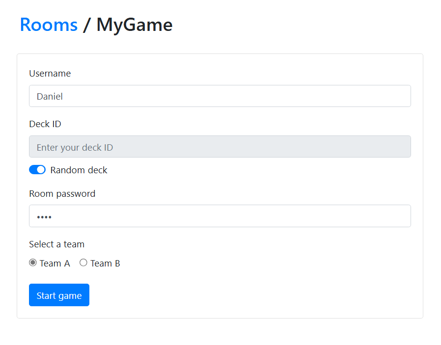

# KeyForge Sandbox

**KeyForge Sandbox** is an unofficial digital adaptation of the card game *KeyForge*, designed by **Richard Garfield**.  
Inspired by *Tabletop Simulator*, this project takes a **sandbox approach** — players can freely move, arrange, and interact with every element on the board.  
It supports **1v1** and **2v2 multiplayer modes**.

<p>
  
</p>

---

## ⚙️ Key Technologies
- **Serverless multiplayer** with client side socket communication
- **Vanilla JavaScript + HTML5 Canvas** rendering  
- **Drag & Drop** interaction system  
- **Real decks support!** Play with your own deck simply by pasting its unique ID, and all the cards will be loaded automatically. You can also use a random real deck selected from the official KeyForge database!

---

## 🚀 Installation & Setup

1. **Download the cards images**  
   The downloader tool will retrieve the card images directly from the official website.

   ```bash
   $ python downloader.py
   ```

2. **Verify** that all cards are downloaded correctly,  
   especially the third expansion, which includes *anomalies* (rare unplayable cards from future sets).

3. **Copy** the card folders (i.e. `341`, `435`, `452`) into:  
   ```
   public/img/cards/
   ```

4. **Install and run:**
   ```bash
   $ npm install
   $ npm start
   ```

6. **Open the game in your browser:**
   ```
   http://localhost:3000/
   ```

---

## 💬 Contributing

Feel free to open **Issues** or submit **Pull Requests**.  
Feedback, ideas, and improvements are always welcome!

---

## 🧡 Acknowledgements
- This project is a fan-made, non-commercial implementation of KeyForge and is not affiliated with Fantasy Flight Games, Ghost Galaxy, or Richard Garfield.  
- Original game: *KeyForge* by **Richard Garfield**  
- Python card downloader: Modified from [Tyrox1 / Keyforge-Downloader](https://github.com/Tyrox1/Keyforge-Downloader)  

---

## Screenshots

<p>
  
  
</p>

<p>
  
</p>

---

Enjoy the game, and may your Archon prevail!
